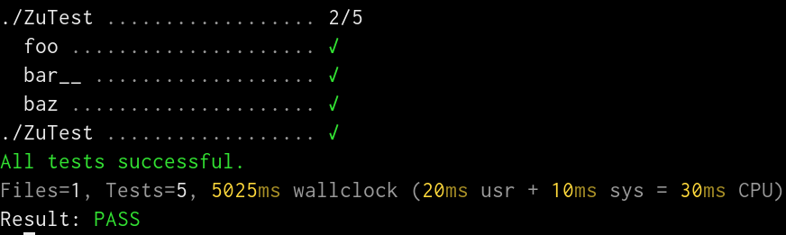

# Test-Harness 3.24

This is a fork of the original Test-Harness with the following changes:
- times displayed in milliseconds
- expanded output of nested sub-tests (-x, --expand=N)
- console output improvements:
  - improved colorization
  - spinner
  - reduced default poll interval (override with --poll=N)
  - unicode output (disable with --noutf)



## Installation

To install Test::Harness using ExtUtils::MakeMaker do:

```
perl Makefile.PL
make
make test
make install
```

This will install Test::Harness and the "prove" program. Type

```
prove --help
```

for more information.

## Copyright and Licence

Copyright (C) 2006, 2007 Curtis "Ovid" Poe

This program is free software; you can redistribute it and/or modify it
under the same terms as Perl itself.
